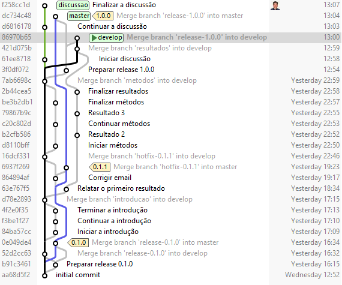

# Hands-on OneFlow

Repositório para exercício prático sobre Git.

Com base na figura abaixo,
refazer o fluxo de Git 
desde a release 0.1.0 
até o commit "Merge branch 'hotfix-0.1.1' into develop" 
usando o OneFlow.

|   |
| :--------------------: |
| **Modelo de Git-flow** |

